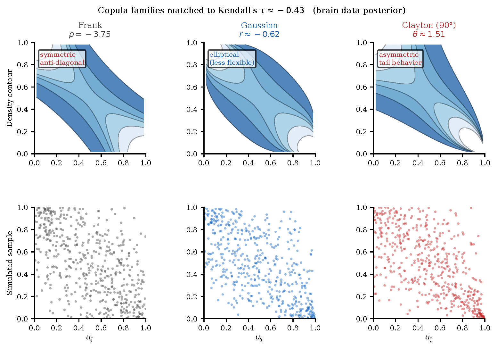

# Block-Separable Copula Generated Random Graphs for Directed Networks

Replication code for:

> Cao, J. and Danielson, A.J. (2026). *Block-Separable Copula Generated Random
> Graphs for Directed Networks.* Working paper.

The model captures dyadic reciprocity in replicated directed networks using a
Frank copula with additive sender/receiver effects. It is applied to effective
connectivity networks in the default mode network (DMN) from resting-state fMRI
across 112 participants (NL / MCI / AD).



---

## Repository layout

```
code/
  python/
    cgrg/                    # Core model package (copula, likelihood, MCMC, data)
    run_brain_model_nuts.py  # Step 1: NUTS sampler — produces posterior draws
    make_paper_figures.py    # Step 2: generates all figures and tables
  legacy/                    # Earlier MATLAB, R, and Python prototypes
data/
  AD_list.mat                # Effective connectivity matrices (12 AD subjects)
  MCI_list.mat               # (63 MCI subjects)
  NL_list.mat                # (37 cognitively normal subjects)
  sim1_list4paper.mat        # Simulation study data (Scenario 1)
  sim2_list4paper.mat        # Simulation study data (Scenario 2)
paper/
  CGRG_brain.tex             # LaTeX source
  CGRG_brain.pdf             # Compiled paper
  *.pdf / *.png              # All figures included in the paper
```

MCMC output (`output_python_plots/`) is not committed — regenerate with Step 1.

---

## Replication

### Dependencies

Python 3.11+ is required. Install dependencies:

```bash
pip install numpyro jax numpy scipy matplotlib networkx
```

Tested with:

| Package | Version |
|---------|---------|
| numpyro | 0.20.0 |
| jax | 0.9.2 |
| numpy | 2.2.6 |
| scipy | 1.14.1 |
| matplotlib | 3.9.2 |
| networkx | 3.3 |

### Step 1 — Run the NUTS sampler

From `code/python/`:

```bash
python run_brain_model_nuts.py \
    --data-dir ../../data \
    --output-dir ../../output_python_plots/nuts_fixed \
    --num-warmup 1000 \
    --num-samples 6000 \
    --num-chains 1 \
    --seed 42
```

Run a second chain for convergence diagnostics:

```bash
python run_brain_model_nuts.py \
    --data-dir ../../data \
    --output-dir ../../output_python_plots/nuts_fixed/chain2 \
    --num-warmup 1000 \
    --num-samples 3000 \
    --num-chains 1 \
    --seed 123
```

Output: `draws_postburn.npz` — an array of shape `(num_samples, 42)` containing
posterior draws in the following layout:

| Index | Parameter |
|-------|-----------|
| 0 | ρ₀ (group-mean reciprocity) |
| 1–3 | ρ⁽ᵍ⁾ for NL, MCI, AD |
| 4–7 | δ₀ (group-mean sender effects) |
| 8–19 | δᵢ sender effects (nodes 2–4, 3 groups) |
| 20–23 | γ₀ (group-mean receiver effects) |
| 24–35 | γⱼ receiver effects (nodes 1–4, 3 groups) |
| 36–38 | λ precision parameters |
| 39 | σ_ρ |
| 40 | σ_δ |
| 41 | σ_γ |

### Step 2 — Generate all figures and tables

From `code/python/`:

```bash
python make_paper_figures.py \
    --chain1 ../../output_python_plots/nuts_fixed/draws_postburn.npz \
    --chain2 ../../output_python_plots/nuts_fixed/chain2/draws_postburn.npz \
    --data-dir ../../data \
    --paper-dir ../../paper \
    --thin 1 \
    --n-ppc 200
```

This writes all figure PDFs directly into `paper/` and prints the LaTeX rows
for Tables 1–3 (posterior ρ summary, node effects, copula comparison) to stdout.

### Step 3 — Compile the paper

From `paper/`:

```bash
pdflatex CGRG_brain.tex && pdflatex CGRG_brain.tex
```

---

## Key results

- Posterior reciprocity: ρ ≈ −3.78 (Kendall's τ ≈ −0.43) for all three groups,
  with 95% credible intervals entirely below zero.
- Pr(ρ_NL < ρ_MCI < ρ_AD | data) = 0.20, close to the uniform chance level of
  1/6, indicating disease state does not substantially alter dyadic reciprocity.
- Frank copula outperforms Gaussian (mean log-density 0.158 vs 0.107) and
  90°-rotated Clayton (−0.020) at matched Kendall's τ.
